# 🧭 dasigr.com v2 — Project Overview

> Single-page portfolio / online resume for **Romualdo Dasig**, Software Engineer, Cebu, Philippines.
> This document supersedes `portfolio-spa-spec.md` v2.3 as the working reference. It is a *cleanup and consolidation*, not a re-decision: every resolved decision from v2.3 is carried forward unchanged unless listed in [§0.2 Review findings](#02-review-findings--what-changed-from-v23).

[-000000?logo=nextdotjs&logoColor=white)](https://nextjs.org/docs)
[](https://react.dev)
[](https://www.typescriptlang.org/docs/)
[](https://tailwindcss.com/docs)
[](https://resend.com/docs)
[](https://vercel.com/docs)
[](#0-document-control)

---

## 📑 Contents

| § | Section | § | Section |
|---|---------|---|---------|
| [0](#0-document-control) | Document control & review findings | [8](#8-api-contract) | API contract |
| [1](#1-overview) | Overview | [9](#9-non-functional-requirements) | Non-functional requirements |
| [2](#2-goals-and-non-goals) | Goals and non-goals | [10](#10-analytics) | Analytics |
| [3](#3-target-users) | Target users | [11](#11-project-structure) | Project structure |
| [4](#4-architecture-and-stack) | Architecture and stack | [12](#12-milestones) | Milestones |
| [5](#5-information-architecture) | Information architecture | [13](#13-acceptance-criteria) | Acceptance criteria |
| [6](#6-content-model) | Content model + **Prisma draft** | [14](#14-decision-log-and-open-questions) | Decision log & open questions |
| [7](#7-functional-requirements) | Functional requirements | [15](#15-future-enhancements-post-v1) | Future enhancements |
| | | [A](#appendix-a--reference-links) | Reference links |

---

## 0. Document control

| Field | Value |
|-------|-------|
| **Project** | dasigr.com (v2) |
| **Owner** | Romualdo Dasig — Software Engineer, Consolacion / Danao City, Cebu, PH |
| **Document** | `project-overview.md` v3.1 (consolidates spec v2.3; §11 realigned to the `src/` layout) |
| **Last updated** | 2026-08-26 |
| **Status** | 🟡 Draft — stack decided, content verified, build not started |
| **Blocking on** | Owner-supplied content: case study `outcome` fields, testimonial consent, project stack confirmations |

### 0.1 At a glance

| | |
|---|---|
| 🎯 **What it is** | One scrollable page (7 sections) + one statically-generated route per published case study |
| 🧱 **Built with** | Next.js 16 App Router · React 19 · TypeScript · Tailwind · deployed on Vercel |
| 📄 **The core mechanic** | The resume PDF is **not** downloadable. A form is the only route to it, so every request is a captured lead |
| 📦 **Portfolio contents** | **8** lead projects (3 featured with cards, 5 as text links) · **3** maintenance clients |
| 🗣️ **Testimonials** | 4 on file, **0 publishable** — all blocked on consent. Section hides itself |
| 📝 **Case studies** | 3 scaffolded, **0 publishable** — all blocked on owner-written content. Routes don't generate |
| 🗓️ **Career claim** | Continuous since **Nov 2008** — 12 software engagements, no gaps, ~17.8 years |
| ⏱️ **Build estimate** | ~17.5 working days across 9 phases |
| 🚫 **No database in v1** | Content lives in typed `.ts` files. See the [Prisma draft](#66-prisma-schema-rough-draft-not-v1-) for the v1.1 path |

### 0.2 Review findings — what changed from v2.3

Twenty-one issues found reviewing spec v2.3 against `projects.ts`, `testimonials.ts`, `case-studies.ts`, the mockup, and the resume PDF. All are fixed in this document.

| # | Severity | Finding | Resolution here |
|---|----------|---------|-----------------|
| 1 | 🔴 High | **FR-4 still describes a parallel freelance track** ("renders alongside the primary track"), which §6.3 explicitly deleted. Building to FR-4 as written produces the wrong timeline | FR-4 rewritten as a single reverse-chronological sequence |
| 2 | 🔴 High | **Acceptance criteria say "all thirteen employment entries"**; §6.3 says fifteen (12 software + 3 earlier). A launch gate that counts wrong is worse than no gate | Corrected to **15** (12 + 3) |
| 3 | 🔴 High | **§6.4 names Constellation Audio and Grand Prix Audio as featured candidates.** Both were removed entirely by §6.6. Stale guidance that could resurrect dropped work | §6.4 rewritten to state the final set only; removed sites live in one table |
| 4 | 🟠 Med | **§6.1 project lists (11 lead / 11 maintenance) contradict §6.6 (8 / 3).** Two counts in one document | Pre-verification lists retained but clearly labelled *superseded* |
| 5 | 🟠 Med | **"~18 years" (§6.3) vs "17+ years" (elsewhere) vs "over 17 years" (PDF)** | Standardised on **17+ years** / *"building for the web since 2008"* |
| 6 | 🟠 Med | **Next.js version policy is wrong.** §4 says "pin to the Active LTS (16.2.x)". Under the [official support policy](https://nextjs.org/support-policy) the *entire 16 major* is Active LTS until 17 ships; 16.2.x is just an older minor. As of 2026-08-26 the patched line is **16.3.3** | Version policy rewritten; see §4.3 |
| 7 | 🟠 Med | **Nav has a `#testimonials` item but the section may not render** (zero consent on file). Dead anchor on launch day | Nav is derived from `hasTestimonials`; §5.3 |
| 8 | 🟠 Med | **Resume PDF orders employment wrong.** `Nov 2018 – Jun 2019` (Freelance) is printed *above* `Jul 2019 – Dec 2020` (Zyrous), breaking reverse-chronological order | Flagged as a PDF fix; site order is correct |
| 9 | 🟠 Med | **Zero case studies are publishable**, so every project card ships link-less and `generateStaticParams()` returns `[]`. Correct by design, but not stated as an expected launch state | Made explicit in §7 FR-10 and §13 |
| 10 | 🟠 Med | **Spam provider undecided** ("Turnstile or hCaptcha") while `.env` already names `TURNSTILE_SECRET_KEY` | Decided: **Cloudflare Turnstile** |
| 11 | 🟠 Med | **Analytics undecided** ("Plausible or Vercel Analytics") | Recommended: **Vercel Analytics** for v1 (zero extra vendor, cookieless); Plausible if the owner wants portable data |
| 12 | 🟡 Low | **§5.2 table is broken** — the Contact row is orphaned below a paragraph, and the intro says "seven sections" over a six-row table | Single seven-row table |
| 13 | 🟡 Low | **§6.5 does not exist** (6.4 → 6.6) | Renumbered |
| 14 | 🟡 Low | **§9.7 is printed before §9.6** | Reordered |
| 15 | 🟡 Low | **FR-9 and FR-10 are printed between FR-5 and FR-6** | Reordered numerically |
| 16 | 🟡 Low | **§11 tree comment says "composes all six sections"**; `components/sections/` omits Testimonials | Corrected |
| 17 | 🟡 Low | **Redirect table promises `/romualdo-dasig-resume.pdf → /#contact`** but the same section explains fragments never reach the server | Table now shows the real target (`/`) with the anchor as client-side behaviour |
| 18 | 🟡 Low | **Skills "Front-end" group omits React** while the mockup shows it, and lists Next.js in two groups | React added; Next.js kept under Platforms only |
| 19 | 🟡 Low | **No serverless timeout budget** for a route that awaits two Resend calls with a PDF attachment | `maxDuration` guidance added to FR-7 |
| 20 | 🟡 Low | **Honeypot response body unspecified** — a bot-rejection 200 that differs from a real 200 tells the bot it was caught | Response shape pinned in §8 |
| 21 | 🟡 Low | **G-2 says "7+ projects"** — ambiguous now that "project" means three cards, five links, and three maintenance names | Restated as measurable counts |

**Not changed** (deliberately): the gate-the-PDF decision, the three-featured-project decision, every exclusion in `excludedFromPortfolio`, the consent gate, and the single-page-plus-case-study-routes architecture. Those are the owner's calls and they are sound.

---

## 1. Overview

### 1.1 Purpose

Replace the current multi-page static site (`index.html`, `about.html`, `projects.html`, `contact.html`) with a single-page application that functions as an online resume. A recruiter must be able to understand the skill set and project history **within one scroll session**, and request a PDF copy of the resume **without leaving the page**.

### 1.2 Problem statement

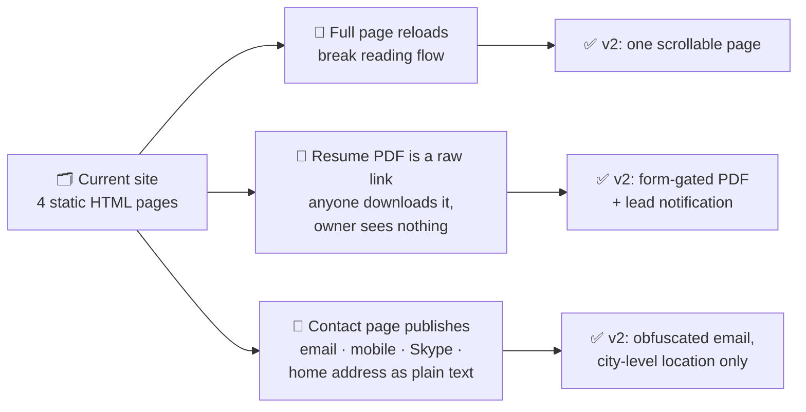

### 1.3 Solution summary

A statically-rendered single page with hash-anchored sections, backed by one serverless Route Handler that validates the form, emails the resume PDF to the requester, and notifies the owner of the lead. Case studies are separate statically-generated routes.

---

## 2. Goals and non-goals

### 2.1 Goals

| ID | Goal | Success measure |
|----|------|-----------------|
| **G-1** | Present skills and work history in one continuous, scannable page | Every section reachable without a page load |
| **G-2** | Showcase verified shipped work | 3 featured cards + 5 lead links + 3 maintenance names, **every URL returning 200** |
| **G-3** | Capture recruiter contact details | Working form, server-side validation, spam protection |
| **G-4** | Deliver the resume PDF by email on request | Email arrives < 60s of submission |
| **G-5** | Give the owner a record of who requested the resume | Notification email per submission, with lead details and working `Reply-To` |
| **G-6** | Load fast on mobile over a Philippine mobile connection | Lighthouse Performance ≥ 90 (mobile) |

### 2.2 Non-goals (v1)

| 🚫 | Not in v1 | Why |
|----|-----------|-----|
| CMS / admin dashboard | Content edited in source files and redeployed | Owner updates a few times a year |
| Database | No persistence layer at all | Mailbox is the lead store — see the [Prisma draft](#66-prisma-schema-rough-draft-not-v1-) for v1.1 |
| Blog / articles | — | Scope |
| Accounts / auth | — | Nothing to log into |
| i18n | English only | Audience is English-speaking recruiters |
| Theme toggle | One well-designed dark theme | May revisit |
| ATS / CRM integration | — | Scope |
| Public PDF download | The form is the only route (FR-7a) | This is the point of the rebuild |

---

## 3. Target users

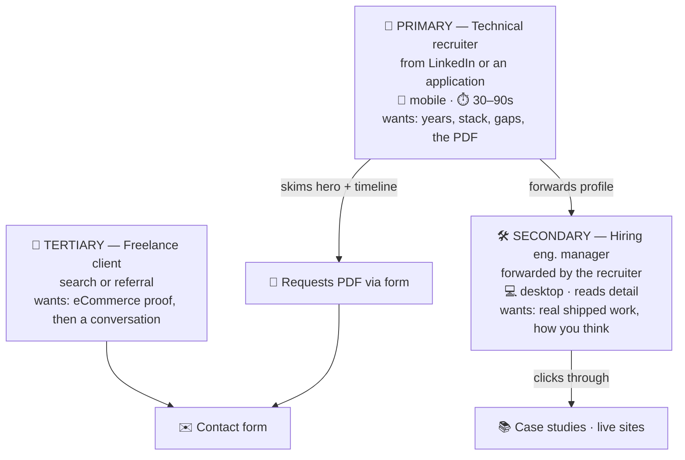

**Design consequence:** the recruiter never opens a case study, and the engineering manager never needs the PDF. Optimise the single page for the first and the `/projects/{slug}` routes for the second.

---

## 4. Architecture and stack

### 4.1 System diagram

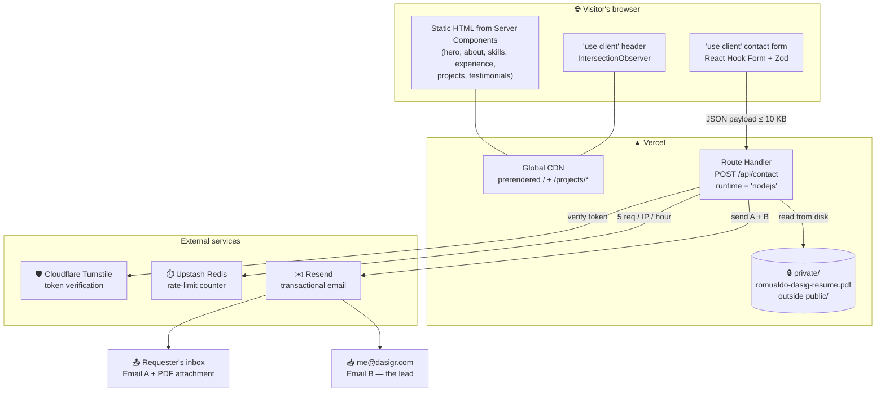

### 4.2 Stack

| Layer | Choice | Why | Docs |
|-------|--------|-----|------|
| Framework | **Next.js 16 (App Router) + TypeScript** | Server Components ship markup, not a render engine; TS catches content-model errors at build | [↗](https://nextjs.org/docs/app) |
| React | React 19 | Required by Next 16 | [↗](https://react.dev/blog) |
| Runtime | Node.js 20+ | Hard requirement of Next 16 | [↗](https://nodejs.org/en/about/previous-releases) |
| Bundler | Turbopack | Default in 16 — no webpack config to maintain | [↗](https://nextjs.org/docs/app/api-reference/turbopack) |
| Styling | Tailwind CSS | Responsive layout without a parallel stylesheet | [↗](https://tailwindcss.com/docs) |
| Animation | Framer Motion *(optional, minimal)* | Section reveal only; must honour `prefers-reduced-motion` | [↗](https://motion.dev/docs) |
| Form state | React Hook Form + Zod | One schema imported by both the Client Component and the Route Handler | [↗](https://react-hook-form.com) · [↗](https://zod.dev) |
| Backend | Route Handler `src/app/api/contact/route.ts`, Node runtime | Node runtime required to read the PDF off disk | [↗](https://nextjs.org/docs/app/building-your-application/routing/route-handlers) |
| Email | **Resend** | Attachment support + delivery logs | [↗](https://resend.com/docs) |
| Spam | **Cloudflare Turnstile** + honeypot | Invisible to legitimate users, no puzzle friction | [↗](https://developers.cloudflare.com/turnstile/) |
| Rate limit | Upstash Redis | Serverless invocations share no memory — the counter must live outside | [↗](https://upstash.com/docs/redis) |
| Images | `next/image` | WebP/AVIF, `srcset`, lazy loading, reserved dimensions | [↗](https://nextjs.org/docs/app/api-reference/components/image) |
| Fonts | `next/font` | Self-hosted, preloaded, zero layout shift | [↗](https://nextjs.org/docs/app/api-reference/components/font) |
| Hosting | Vercel | First-party Next support, git-push deploys, free TLS | [↗](https://vercel.com/docs) |
| Analytics | **Vercel Analytics** (Plausible as alternative) | Cookieless → no consent banner | [↗](https://vercel.com/docs/analytics) |

### 4.3 Version policy ⚠️ *corrected*

Next.js runs a two-phase LTS model: a major is **Active LTS** from release until the next major ships, then **Maintenance LTS** for two years from its *original* release date. So **the whole 16.x line is Active LTS** — "pinning to Active LTS 16.2.x" (spec v2.3 §4) confuses a minor with a phase.

- Track the **current stable 16.x minor**; as of 2026-08-26 that is the August security release line (**16.3.3**).
- Security patches now ship on a **pre-announced monthly schedule**, so some upgrade cadence is mandatory. A portfolio whose entire job is demonstrating engineering judgment cannot sit unpatched for a year.
- Check [nextjs.org/support-policy](https://nextjs.org/support-policy) and the [blog](https://nextjs.org/blog) at build time and again at cutover — these numbers move monthly.
- Add Dependabot or Renovate on the repo so the monthly bump is a PR, not a memory task.

### 4.4 Server Action vs Route Handler

A Server Action is the more idiomatic App Router pattern and avoids hand-writing an endpoint. **This project uses a Route Handler anyway**, for three reasons: the §8 contract stays explicit and testable with `curl`; captcha verification and rate limiting are easier to reason about at an HTTP boundary; and the endpoint is reusable if a second form is ever added.

Either is defensible. If the owner switches, §8 becomes the action's input schema and return type rather than an HTTP contract, and the Turnstile check moves inside the action body.

---

## 5. Information architecture

### 5.1 The single-page decision

Next.js route segments give real URLs and clean per-route metadata — but each is a distinct *page*, which is the multi-page model this rebuild exists to replace.

**Resolution:** one canonical route, `src/app/page.tsx`, rendering all seven sections. Sections are addressed by hash fragment (`/#projects`), not by route segment. One server-rendered document that crawlers index as a unit, with shareable deep links.

**Trade-off accepted:** one `<title>` and one meta description for the whole site rather than seven. For a personal portfolio ranking on the owner's name, that is the correct trade — the competing content is not other pages of the same site.

**Amendment — case study routes.** Case studies add a second route pattern, `src/app/projects/[slug]/page.tsx`. This does *not* reopen the decision above: that decision was about the seven main sections being one continuous scroll, and they remain so. A case study is a different kind of document — the recruiter never opens one; the engineering manager who does opens it deliberately, having already decided the profile is worth time. It is a destination, not a section.

Two things this recovers: each case study gets its own `<title>`, description, and OG image, and each becomes independently linkable and rankable. *"Romualdo Dasig headless Drupal case study"* is a query the single page could never rank for. Statically generated via `generateStaticParams()`, so it costs nothing at runtime.

### 5.2 Route and section map

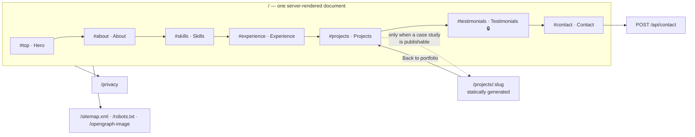

| # | Section | Anchor | Purpose | Renders? |
|---|---------|--------|---------|----------|
| 1 | Hero | `#top` | Name, title, positioning line, career timeline, primary CTA | ✅ Always |
| 2 | About | `#about` | Professional narrative and career summary | ✅ Always |
| 3 | Skills | `#skills` | Grouped technical competencies | ✅ Always |
| 4 | Experience | `#experience` | Reverse-chronological work history + education | ✅ Always |
| 5 | Projects | `#projects` | Featured grid, additional lead list, maintenance line | ✅ Always |
| 6 | Testimonials | `#testimonials` | Client quotes | 🔒 **Only if ≥1 has consent** |
| 7 | Contact | `#contact` | Form, resume request, direct channels | ✅ Always |

Plus one route per **published** case study at `/projects/{slug}` — currently **zero**.

### 5.3 Navigation behaviour

- Sticky header, visible at all scroll positions.
- Nav click smooth-scrolls and updates the hash without a reload.
- Active section highlighted on scroll via `IntersectionObserver`.
- Direct entry to `/#projects` scrolls to that section on mount, after hydration.
- `scroll-margin-top` on every section equal to header height, so anchored sections are not hidden under the sticky header.
- Mobile (< 768px): hamburger opening a full-screen overlay.
- ⚠️ **The nav array is derived, not hardcoded.** The Testimonials item is included only when `hasTestimonials === true`. Otherwise the header ships a link to a section that does not exist.

### 5.4 Server / Client Component boundary

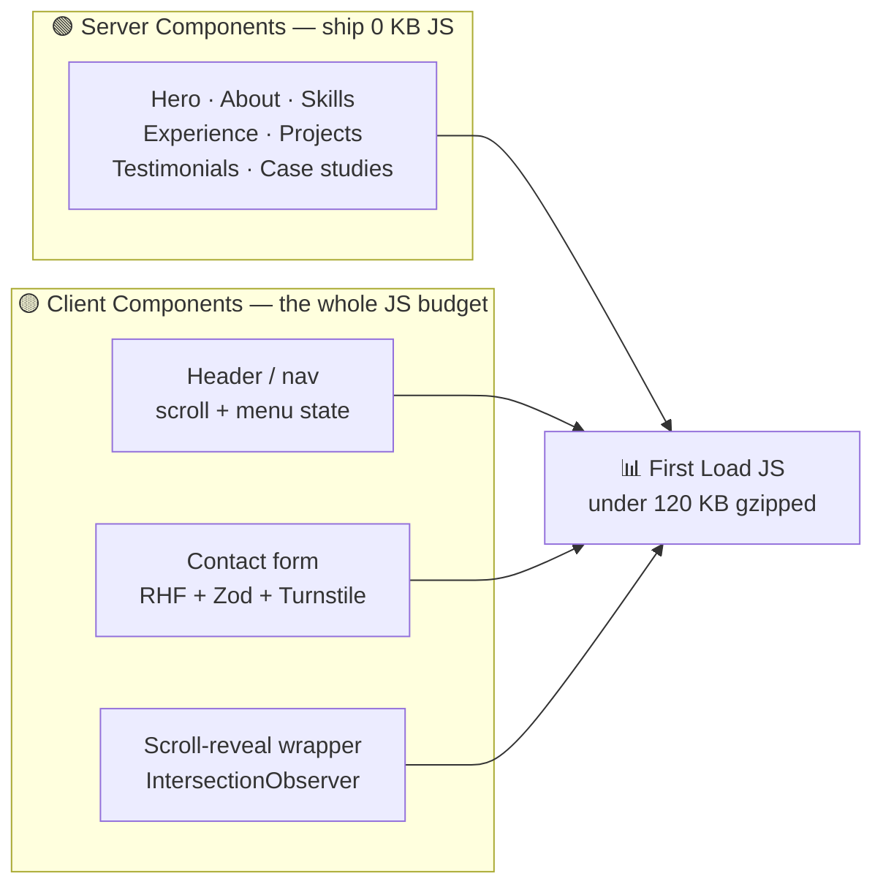

Keeping this boundary tight is what earns the §9.1 performance budget. Every section that becomes a Client Component for a minor flourish adds to the bundle a recruiter on mobile data has to download. **Any regression in the `next build` First Load JS figure should be traced to a new `'use client'` boundary.**

---

## 6. Content model

Content lives in typed data files under `src/content/`, not hardcoded in JSX. Updates are a one-line edit and a redeploy.

### 6.1 Entity relationships

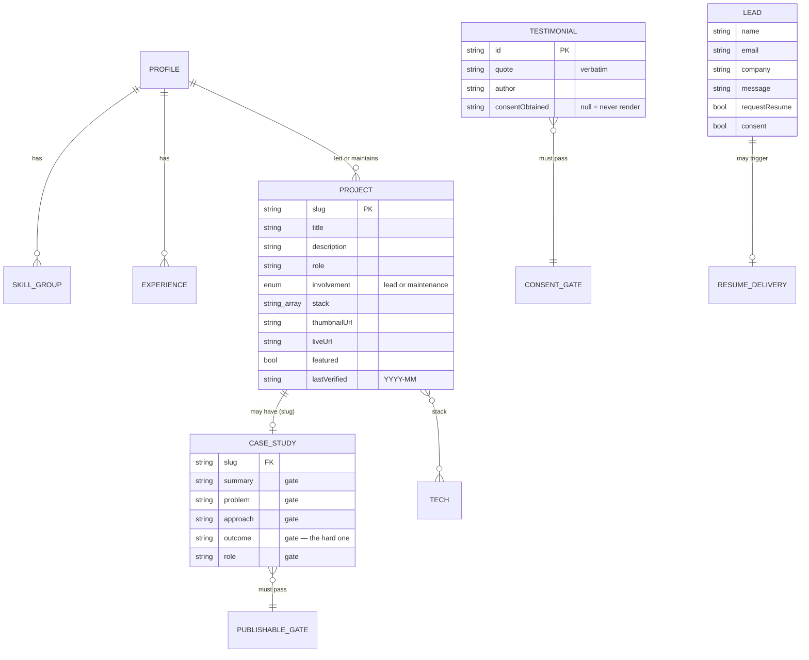

### 6.2 TypeScript interfaces — *the actual v1 source of truth*

```ts
interface Profile {
  name: string;
  title: string;
  tagline: string;
  location: string;          // city-level only — never a street address (FR-8)
  portraitUrl: string;
  socials: { linkedin: string; github: string };
}

interface SkillGroup {
  category: string;          // "Platforms" | "Back-end" | "Front-end" | "Quality & tooling" | "Infrastructure"
  skills: string[];
}

interface Experience {
  company: string;
  role: string;
  location: string;
  startDate: string;         // "YYYY-MM"
  endDate: string | null;    // null = current
  highlights: string[];      // 2–4 bullets
  stack?: string[];
  track: 'primary' | 'earlier';   // 'freelance' removed — see §6.4
}

interface Project {
  slug: string;
  title: string;
  description: string;       // 1–2 sentences. What it does, not adjectives
  role: string;
  involvement: 'lead' | 'maintenance';
  stack: string[];
  thumbnailUrl: string;      // WebP, 800×600
  liveUrl?: string;
  repoUrl?: string;
  featured: boolean;
  lastVerified: string;      // "YYYY-MM" — see §13 link-rot check
}

interface Testimonial {
  id: string;
  quote: string;                    // verbatim — never paraphrase a client
  author: string;
  role?: string;
  company?: string;
  date?: string;                    // "YYYY"
  consentObtained: string | null;   // null = MUST NOT render
}

interface CaseStudy {
  slug: string;                     // must match a Project.slug
  summary: string;
  problem: string;
  constraints: string[];
  approach: string;
  decisions?: { decision: string; rationale: string; tradeoff?: string }[];
  outcome: string;                  // ⭐ the field that makes it a case study
  role: string;
  team?: string;
  duration?: string;
  stack: string[];
  images?: { src: string; alt: string; caption?: string }[];
  lastUpdated: string;              // "YYYY-MM"
}
```

**Two derived exports do the gatekeeping and nothing else may bypass them:**

```ts
// src/content/testimonials.ts
export const publishableTestimonials = testimonials.filter(
  (t) => t.consentObtained !== null && t.quote.trim().length > 0,
);
export const hasTestimonials = publishableTestimonials.length > 0;

// src/content/case-studies.ts
export const isPublishable = (c: CaseStudy) =>
  c.summary.trim() && c.problem.trim() && c.approach.trim() &&
  c.outcome.trim() && c.role.trim();
export const caseStudySlugs = publishedCaseStudies.map((c) => c.slug);  // drives generateStaticParams()

// src/content/projects.ts — use these in copy, never hardcode a number
export const leadProjectCount = allLeadProjects.length;        // 8
export const maintenanceClientCount = maintenanceClients.length; // 3
```

> 💡 **Why derived counts matter:** the resume and the site drifted apart once already (11/11 vs 8/3). Copy that reads `{leadProjectCount} sites led` cannot drift again.

### 6.3 Employment history

Reverse-chronological by start date. **15 entries: 12 software (`primary`) + 3 electronics (`earlier`).**

> 📄 **`private/romualdo-dasig-resume.odt` is the source of truth for this table.** It is the editable original the PDF exports from. This table is a reconciliation *of* it, and `src/content/experience.ts` implements this table. When the ODT changes, both follow — never the reverse.

| Company | Role | Location | Dates | Track |
|---------|------|----------|-------|-------|
| Freelance / Upwork | Software Engineer | Danao City, Cebu | Jun 2026 – **Present** | primary |
| Dentsu Myco Services Inc. | Drupal & PHP Developer | Makati City, Manila | Dec 2021 – May 2026 | primary |
| Freelance / Upwork | Software Engineer | Consolacion, Cebu | Jul 2021 – Nov 2021 | primary |
| Peregrine Consulting Group | Software Engineer | Chicago, Illinois | Jan 2021 – Jun 2021 | primary |
| Zyrous Pty Ltd. | Software Engineer | Perth, Western Australia | Jul 2019 – Dec 2020 | primary |
| Freelance / Upwork | Software Engineer | Consolacion, Cebu | Nov 2018 – Jun 2019 | primary |
| True Apex | Software Engineer | San Diego, California | Mar 2015 – Oct 2018 | primary |
| Bridge Technology Partners | Software Engineer | Cebu Business Park, Cebu City | Oct 2014 – Mar 2015 | primary |
| Elementz Interactive Inc. | Software Engineer | IT Park, Cebu City | Feb 2013 – Sep 2014 | primary |
| Freelance / oDesk | Software Engineer | Consolacion, Cebu | Jan 2012 – Jan 2013 | primary |
| Infocus Multimedia and Business Solutions<br/>*(formerly Sports In Focus Pty. Ltd.)* | Web Developer | Mandaue City, Cebu | Aug 2011 – Dec 2011 | primary |
| Freelance / ScriptLance | **Web Developer** | Consolacion, Cebu | Nov 2008 – Jul 2011 | primary |
| Teradyne Philippines Ltd. | Board Repair Specialist, A5XX Systems Department | Lapu-Lapu City, Cebu | Aug 2007 – Oct 2010 | earlier |
| Teradyne Philippines Ltd. | Trainee, A5XX Systems Department | Lapu-Lapu City, Cebu | Mar 2006 – Mar 2007 | earlier |
| Cebu Mitsumi, Inc. | Trainee, KKO Division | Danao City, Cebu | Dec 2005 – Mar 2006 | earlier |

**🎓 Education:** CITE Technical Institute — Industrial Technician Program, Major in Industrial Electronics Technology, San Jose, Cebu City, June 2007.

> ✅ **Two long-standing corrections landed with the ODT sync.** The reverse-chronological order is now correct in the resume itself — the `Nov 2018 – Jun 2019` freelance entry no longer prints above Zyrous, so the PDF fix this section demanded is done. And **True Apex is "Software Engineer"**, not "Web Designer and Developer"; the old title came from the pre-rebuild site and the ODT never agreed with it.

> ✅ **The current freelance entry now names Next.js, and it was fixed in the ODT.** It had been carrying the 2021 and 2018 freelance periods' three Drupal bullets verbatim, so the Experience section's current role read Drupal-first while §6.1's hero and §6.2's About led with Next.js. The rewritten entry has six bullets — AI-assisted development (Claude Code, v0), Drupal 10/11, JSON:API, **Next.js**, third-party APIs (Stripe, Resend), and CI/CD across GitHub/Bitbucket, Docker, Vercel, AWS and GCP — and `experience.ts` copied them. The drift closed at the source, which is the only place it closes.

### 6.4 Timeline

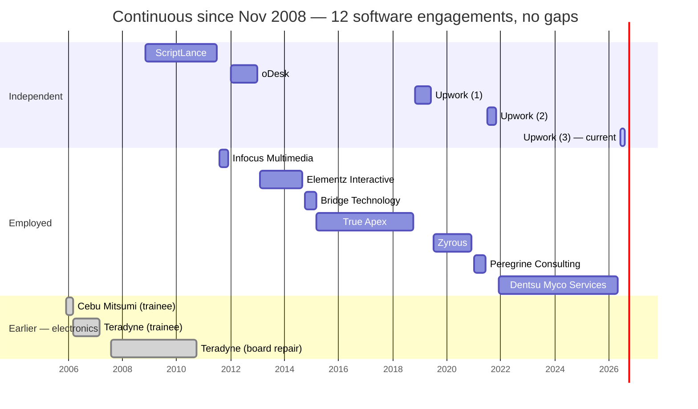

**No parallel freelance track.** All five freelance periods are bounded and sequential on the primary track. The `track` union is `'primary' | 'earlier'` — `'freelance'` is dropped.

**One overlap remains and is fine:** freelancing from Nov 2008 alongside the Teradyne board-repair role, which ran to Oct 2010. That reads naturally as evening and weekend work during the hardware-to-software transition, and it is the *visible evidence* of that transition.

**Five freelance entries.** Keep them chronological, with bullets differentiated per period so they are not five copies. Consolidating into one "Nov 2008 – Present (five periods)" entry is shorter but flattens the story and hides that freelancing was full-time work between roles. Consider it only if the PDF needs to lose a page.

**Earlier career.** The three electronics roles are genuine and they explain the trajectory, but three board-repair entries at the foot of a software portfolio dilute the page. Collapse into a single *"Earlier career: electronics and test engineering, 2005–2010"* line with an expand affordance. Keep them in full on the PDF.

**Years of experience — standardised.** Nov 2008 → Aug 2026 is **17 years 9 months**. Use **"17+ years"** or *"building for the web since 2008"* everywhere: site, PDF, and LinkedIn. Do not use "~18" (spec §6.3) or "more than 15" (older PDF revisions).

**Still to confirm with the owner:**

- [ ] Exact start/end months for the two derived freelance periods (Jan 2012 – Jan 2013 and Nov 2018 – Jun 2019).
- [ ] The bullets on both derived entries — drafted from existing freelance wording, not supplied. Replace with what was actually built.
- [ ] The Nov 2008 – Jul 2011 entry previously listed Next.js, React, and Angular. **None existed in usable form in that window** (Angular 2010, React 2013, Next.js 2016). Now reads Drupal, WordPress, CodeIgniter, HTML5/CSS3/jQuery — confirm.

### 6.5 Skills

The resume's eight categories condense into five for scannability.

| Group | Contents |
|-------|----------|
| **⚙️ Platforms** | Next.js · Drupal 7–11 + Drupal Commerce · WordPress + WooCommerce · Laravel |
| **🔧 Back-end** | RESTful API design · JSON:API · third-party API integration · PHP, Python, C/C++ · MySQL, MariaDB, Postgres · MVC · OOP and design patterns |
| **🎨 Front-end** | **React** · JavaScript · HTML5, CSS3, SASS · jQuery · Bootstrap · Twig · BEM, SMACSS · Figma · v0 |
| **🧪 Quality & tooling** | PHPUnit · Selenium · Playwright · Jenkins CI · Git / Git Flow · Composer, DDEV, Drush · PSR-0/PSR-4 · Drupal coding standards · BrowserStack · JIRA |
| **☁️ Infrastructure** | Docker · Kubernetes · AWS · Google Cloud · Pantheon · shell scripting · SSH |

- Rendered as grouped tags. **No proficiency percentage bars** — they read as arbitrary to technical reviewers.
- The resume's **Systems Administration** and **Development Tools** categories merge into the last two groups.
- The **Marketing** category (SEO, email, social, paid ads) is **dropped from the site's skills grid** — it dilutes the software-engineering signal for a technical audience. Keep it on the PDF, where a different reader may value it.
- ⚠️ Next.js appears under Platforms only (spec v2.3 listed it twice); React was missing from Front-end and is added.

**🤖 AI tooling is a differentiator, not a tag.** Building with v0 and Claude is a live hiring signal in 2026 and it is currently buried in a resume bullet list. Surface it in the **About narrative** — *"I design in Figma or start from v0, and build with Claude in the loop, the same way I use Composer or Drush"* — rather than as one more chip in the skills grid.

### 6.6 Prisma schema: rough draft, not v1 🚧

> ### ⚠️ Read this before using the schema below
>
> **v1 has no database.** Content lives in typed `.ts` files (§2.2) and the owner's mailbox is the only lead store (§9.5). This schema is a **rough first pass** at the v1.1 path in [§15](#15-future-enhancements-post-v1) — *"lead storage in a lightweight database with a private dashboard"* — sketched now so the shape of the data is agreed while the content model is fresh.
>
> Field names, indexes, and nullability are **not final**. Nothing here has been validated against a running Postgres instance.
>
> **Two halves, two different decisions:**
> - **`Lead` / `ResumeDelivery`** — genuinely useful. It turns "who asked for my resume" from a mailbox search into a query, and it is the only part worth building at v1.1.
> - **`Project` / `CaseStudy` / `Testimonial` / `ExperienceEntry`** — sketched for completeness, but adopting them means building an admin UI, which **directly contradicts the "no CMS" non-goal**. At a few content edits a year, a `.ts` file and a redeploy is cheaper than a database, a dashboard, and an auth layer. Do not build this half without a real reason.

```prisma
// prisma/schema.prisma
// 🚧 ROUGH DRAFT — v1.1 candidate, not built. See §6.6 caveats.
// Nothing below is wired to the v1 site.

generator client {
  provider = "prisma-client-js"
}

datasource db {
  provider = "postgresql"           // Vercel Postgres / Neon / Supabase
  url      = env("DATABASE_URL")
}

/* ============================================================
   LEAD CAPTURE — the half actually worth building (G-5)
   ============================================================ */

model Lead {
  id             String    @id @default(cuid())
  name           String    @db.VarChar(100)
  email          String    @db.VarChar(254)
  company        String?   @db.VarChar(100)
  message        String    @db.Text
  requestedResume Boolean  @default(true)

  // Consent evidence — RA 10173 / GDPR. Store the proof, not just the boolean.
  consentGiven   Boolean
  consentAt      DateTime
  privacyNoticeVersion String @db.VarChar(20)   // e.g. "2026-08-26"

  // Request context. NOTE: ipAddress is personal data under GDPR.
  // Prefer a truncated or hashed value, or drop the column entirely
  // and keep rate limiting in Redis where it expires on its own.
  ipHash         String?   @db.VarChar(64)
  userAgent      String?   @db.Text
  referrer       String?   @db.Text

  status         LeadStatus @default(NEW)
  ownerNotes     String?    @db.Text

  deliveries     ResumeDelivery[]

  createdAt      DateTime  @default(now())
  updatedAt      DateTime  @updatedAt
  // Retention (§9.5): purge or anonymise on a schedule. A row kept forever
  // is a row you must answer a deletion request about.
  purgeAfter     DateTime?

  @@index([createdAt])
  @@index([email])
  @@index([status])
  @@map("leads")
}

model ResumeDelivery {
  id             String    @id @default(cuid())
  lead           Lead      @relation(fields: [leadId], references: [id], onDelete: Cascade)
  leadId         String

  resumeVersion  String    @db.VarChar(20)     // "2026-07" — which PDF went out
  providerMessageId String? @db.VarChar(120)   // Resend id, for log lookups
  status         DeliveryStatus @default(QUEUED)
  errorMessage   String?   @db.Text

  sentAt         DateTime?
  createdAt      DateTime  @default(now())

  @@index([leadId])
  @@index([status])
  @@map("resume_deliveries")
}

enum LeadStatus {
  NEW
  READ
  REPLIED
  ARCHIVED
  SPAM
}

enum DeliveryStatus {
  QUEUED
  SENT
  BOUNCED
  FAILED
}

/* ============================================================
   CONTENT — sketch only. Building this means building a CMS.
   Re-read the §2.2 non-goal before you migrate any of it.
   ============================================================ */

model Project {
  id           String       @id @default(cuid())
  slug         String       @unique @db.VarChar(60)
  title        String       @db.VarChar(120)
  description  String       @db.Text          // 1–2 sentences
  role         String       @db.VarChar(80)   // "Lead Developer", "Founder and Developer"
  involvement  Involvement
  stack        String[]                       // Postgres text[]
  thumbnailUrl String       @db.VarChar(255)  // WebP 800×600
  liveUrl      String?      @db.VarChar(255)
  repoUrl      String?      @db.VarChar(255)
  featured     Boolean      @default(false)
  sortOrder    Int          @default(0)

  // Link-rot discipline (§13) — the reason the .ts file exists at all
  lastVerified DateTime?
  lastStatusCode Int?

  caseStudy    CaseStudy?
  exclusion    Exclusion?

  createdAt    DateTime     @default(now())
  updatedAt    DateTime     @updatedAt

  @@index([featured, sortOrder])
  @@map("projects")
}

model CaseStudy {
  id          String    @id @default(cuid())
  project     Project   @relation(fields: [projectSlug], references: [slug], onDelete: Cascade)
  projectSlug String    @unique @db.VarChar(60)

  summary     String    @db.Text
  problem     String    @db.Text
  constraints String[]
  approach    String    @db.Text
  outcome     String    @db.Text    // ⭐ the gate that makes it a case study
  role        String    @db.VarChar(120)
  team        String?   @db.VarChar(200)
  duration    String?   @db.VarChar(60)
  stack       String[]

  decisions   Decision[]
  images      CaseStudyImage[]

  // Mirrors isPublishable() — kept as a column so a half-written draft
  // can live in the DB without generating a route.
  published   Boolean   @default(false)
  publishedAt DateTime?
  lastUpdated DateTime  @updatedAt

  @@index([published])
  @@map("case_studies")
}

model Decision {
  id          String    @id @default(cuid())
  caseStudy   CaseStudy @relation(fields: [caseStudyId], references: [id], onDelete: Cascade)
  caseStudyId String
  decision    String    @db.Text
  rationale   String    @db.Text
  tradeoff    String?   @db.Text      // a decision with no cost is a feature list
  sortOrder   Int       @default(0)

  @@index([caseStudyId, sortOrder])
  @@map("decisions")
}

model CaseStudyImage {
  id          String    @id @default(cuid())
  caseStudy   CaseStudy @relation(fields: [caseStudyId], references: [id], onDelete: Cascade)
  caseStudyId String
  src         String    @db.VarChar(255)
  alt         String    @db.VarChar(255)   // required — §9.2
  caption     String?   @db.VarChar(255)
  sortOrder   Int       @default(0)

  @@index([caseStudyId, sortOrder])
  @@map("case_study_images")
}

model Testimonial {
  id        String    @id @default(cuid())
  quote     String    @db.Text            // verbatim — never paraphrase a client
  author    String    @db.VarChar(120)
  role      String?   @db.VarChar(120)
  company   String?   @db.VarChar(120)
  givenOn   String?   @db.VarChar(7)      // "YYYY" or "YYYY-MM"

  // HARD GATE. null = must never render. Mirrors consentObtained.
  consentObtainedAt DateTime?
  consentEvidence   String?  @db.Text     // where the permission is recorded
  sortOrder Int       @default(0)

  createdAt DateTime  @default(now())

  @@index([consentObtainedAt])
  @@map("testimonials")
}

model ExperienceEntry {
  id        String    @id @default(cuid())
  company   String    @db.VarChar(160)
  role      String    @db.VarChar(120)
  location  String    @db.VarChar(120)
  startDate DateTime                       // month precision; store day 01
  endDate   DateTime?                      // null = current
  highlights String[]
  stack     String[]
  track     Track     @default(PRIMARY)

  @@index([startDate])
  @@map("experience_entries")
}

/// Sites removed from the portfolio, with reasons — so a dead link is never
/// re-added from an old resume six months later. Mirrors excludedFromPortfolio.
model Exclusion {
  id         String   @id @default(cuid())
  project    Project? @relation(fields: [projectSlug], references: [slug])
  projectSlug String? @unique @db.VarChar(60)
  name       String   @db.VarChar(120)
  formerUrl  String?  @db.VarChar(255)
  reason     String   @db.Text
  checkedAt  DateTime?

  @@map("exclusions")
}

enum Involvement {
  LEAD
  MAINTENANCE
}

enum Track {
  PRIMARY
  EARLIER
}
```

**Open questions on this draft**

| # | Question |
|---|----------|
| P-1 | Does storing leads add enough over a searchable mailbox to justify a database, an auth layer, and a dashboard? If the honest answer is "not yet", stay on v1. |
| P-2 | If leads *are* stored, `ipHash` and `userAgent` become personal data. Either drop both columns or document them in the privacy notice — the notice cannot be written after the schema. |
| P-3 | Retention: what actually purges rows? A `purgeAfter` column with no cron job is decoration. |
| P-4 | Rate limiting stays in **Redis**, not Postgres. It needs TTL semantics and sub-millisecond reads, and it must not share a failure domain with the lead write. |
| P-5 | If content ever migrates, the `.ts` files become a seed script — write `prisma/seed.ts` from them rather than hand-entering 8 projects and 15 roles. |

### 6.7 Projects — what ships

All 22 resume URLs were verified on **2026-08-25**. Two were dead, four blocked automated checks, and several resolved but no longer represent the owner's work. **"Live" alone is not the bar** — the question is whether the site a recruiter lands on is still evidence of his engineering.

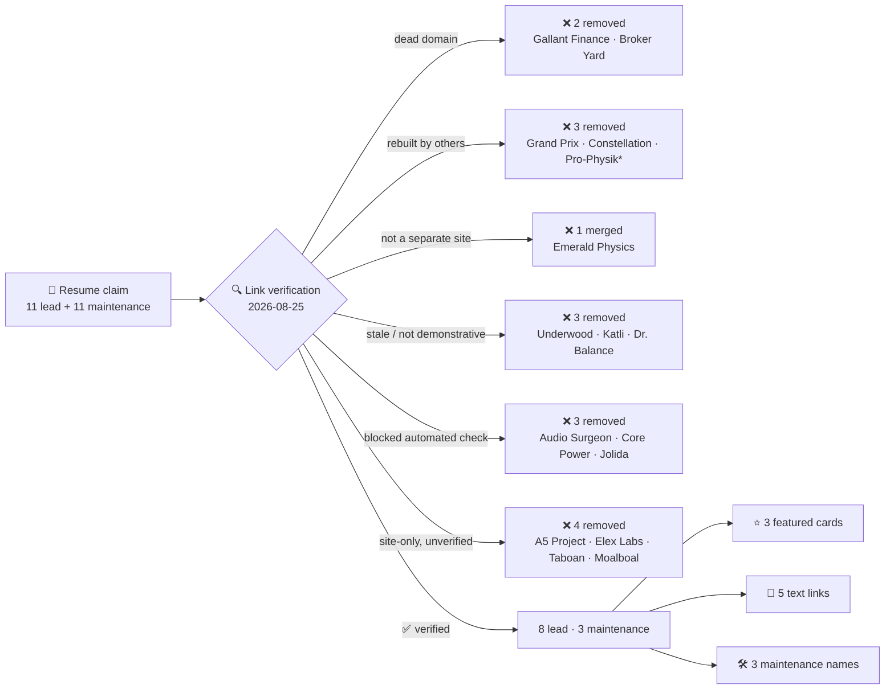

*\*Pro-Physik remains as **past** maintenance, framed accordingly.*

#### ⭐ Featured — the three the page leads with

| Project | Role | Stack | Status | Link |
|---------|------|-------|--------|------|
| **CebuFest** | Lead Developer | Next.js · React · `next/image` · Agoda affiliate | ✅ Verified 2026-08. Strongest piece — trip-planner logic, blog authored 2026 | [cebufest.com](https://www.cebufest.com) |
| **PV System Tek** | Lead Developer | Next.js · React · `next/image` | ✅ Verified 2026-08. Live quotation estimator sizes a system from a monthly bill | [pvsystemtek.com](https://www.pvsystemtek.com) |
| **Accu-Glass Products** | Lead Developer | Drupal (headless) · decoupled API subdomain | ✅ Verified 2026-08. B2B UHV components, 25+ categories, quick order, distributor accounts | [accuglassproducts.com](https://www.accuglassproducts.com) |

Two are Next.js, aligning the portfolio with the stack this site is built in; the third demonstrates headless Drupal at B2B scale.

> ⚠️ **CebuFest URL:** the resume links `http://`. The canonical is `https://`. Fix in the PDF.

#### 🔗 Additional lead work — text links, no thumbnails

| Project | Stack | Note |
|---------|-------|------|
| **Pass Labs** | WordPress · custom `passlab` theme · PHP | Dealer locator, product registration; assets dated 2019 |
| **Duniway Stockroom** | Drupal · custom theme · PHP | 9 categories, cart, documents library |
| **BGW Amplifiers** | Drupal · custom theme · PHP | Cinema-sound amplifier lines, client roster, timeline |
| **ElexParts** | Drupal 7 · Drupal Commerce · PHP | Owner's own store. ⚠️ **Drupal 7 is EOL (Jan 2025) — never feature** |
| **Trip to Philippines** | Drupal 7 · PHP | ⚠️ Drupal 7 EOL; content last updated 2017 |

#### 🛠️ Maintenance — one line of client names

**Seiwa Optical America** · **Arctic Zero** — ongoing. **Pro-Physik** — *previously* (live and active, but rebuilt by German agency WebJazz for Wiley-VCH; **do not imply current involvement**).

#### ❌ Excluded — recorded so they are never re-added

Kept in `excludedFromPortfolio` in `src/content/projects.ts`. The reason is the point: it is what stops a dead link being pulled back off an old resume six months from now.

| Site | Reason |
|------|--------|
| Gallant Finance · Broker Yard | ❌ **Domains dead** — parked for sale on HugeDomains. The worst possible destination for a portfolio link |
| Grand Prix Audio | ❌ Rebuilt on Wix by someone else |
| Constellation Audio | ❌ Rebuilt on WordPress + Elementor, modified 2024. Owner confirmed removal |
| Emerald Physics | ❌ Redirects into underwoodhifi.com — never a separate client; listing both inflated the count |
| Underwood HiFi | ❌ Drupal 7, © 2021; banner states the business is closed until further notice |
| Katli Audio | ❌ Hand-written static HTML, no viewport meta — **not mobile-responsive**, which contradicts the responsive-development claim |
| Dr. Balance | ❌ Bare WordPress, stock theme, one placeholder page, images hotlinked from another domain. Demonstrates nothing |
| The Audio Surgeon · Core Power Technologies · Jolida | ❌ Blocked automated verification; owner removed rather than confirm |
| A5 Project | ❌ Owner's own freelance brand, not client work. Drupal 7, © 2018. Publishes his street address and two mobile numbers, and its "Meet the Team" lists him **four times under four roles**. *"Freelance / A5 Project" stays as the employment label — only the portfolio link is dropped* |
| Elex Labs · Taboan · Moalboal Beach Resorts | ❌ Site-only projects, never verified |

> 📌 **Recount consequence.** "11 lead + 11 maintenance" does not survive verification. The defensible figures are **8 lead and 3 maintenance**, and **the resume PDF must be updated to match** before launch — the two artifacts get read side by side.

### 6.8 Testimonials (currently zero publishable) 🔒

Source: the "Our Clients" carousel on `a5project.com` (© 2018). Four quotes exist. **None can render today.**

| Author | Company | Context | Quote pasted? | Consent? | Publishable |
|--------|---------|---------|---------------|----------|-------------|
| Abinayan Emanu | InSupport | PHP 7 upgrade and Drupal development | ❌ | ❌ | 🔒 No |
| John Carlos | Viacom *(unverified)* | Drupal work | ❌ | ❌ | 🔒 No |
| Ney Flores | — | — | ❌ | ❌ | 🔒 No |
| The Designer's Mob | — | — | ❌ | ❌ | 🔒 No |

**Two gates, both hard:**

1. **📋 Paste the quote verbatim** from a5project.com — copy, don't retype, so the wording matches what the client actually wrote. Never paraphrase or tidy a client's words.
2. **✍️ Get consent.** Each entry names a real person and three name an employer. Republishing that is processing personal data under [RA 10173](https://privacy.gov.ph/data-privacy-act/) and, for any EU-based reviewer, GDPR. A short message asking permission is enough — record the date in `consentObtained`. `null` means the entry cannot reach the page, enforced by the `publishableTestimonials` filter.

**Two attribution problems to resolve first:**

- **John Carlos / Viacom** — naming a major media company implies a client relationship. If the work came through a freelance marketplace or in a personal capacity, the company name overstates it and is exactly the claim a recruiter may probe. **Attribute to the person alone unless the engagement really was with Viacom.**
- **The Designer's Mob** — a handle with no person, role, or company behind it. Unattributed praise reads as filler at best and invented at worst. Ask for a name and title, or drop it.

**They are also ~8 years old**, describing PHP 7 and Drupal 7 work, which sits oddly beside a portfolio led by two Next.js builds. Stale praise still beats none — but 💡 **the consent conversation is a natural opening to ask for one fresh line about recent work. A 2026 testimonial mentioning Next.js would be worth more than all four of these.**

**Rendering rules:** static grid of 2–4 quotes, **no carousel** (auto-rotating quotes hide content behind a timer, are awkward with a keyboard, and a recruiter skimming for 60 seconds sees one of four). No star ratings, no stock avatars, no quotation-mark graphics larger than the text. Placed between Projects and Contact, so the social proof sits immediately before the ask. **The section does not render at all if nothing is publishable** — an empty or single-item testimonials block is worse than none.

### 6.9 Case studies (currently zero publishable) 📚

Three scaffolds exist in `src/content/case-studies.ts`, one per featured project. All four gate fields (`summary`, `problem`, `approach`, `outcome`, `role`) are empty, so `getCaseStudy()` returns `undefined`, no cards link anywhere, and `generateStaticParams()` returns an empty array. **This is the correct launch state, not a bug.**

| Slug | The story to tell | The hard part |
|------|-------------------|---------------|
| `cebufest` | Why Next.js over the Drupal you knew best; why Agoda affiliate rather than direct booking; how hotels get matched to each night's stop | Traffic, itineraries generated, bookings, affiliate revenue — *any* real figure |
| `pv-system-tek` | How the estimator sizes a system from a monthly bill; why an instant on-page estimate instead of a callback form | Quote requests per month, conversion, installs attributed to the site |
| `accu-glass-products` | The headless split and the `api.swarm.` subdomain — **the strongest technical story on the site**. Why decouple rather than rebuild the monolith, and what the decoupling cost | Page load, order volume, quick-order adoption, catalogue size handled |

> ### ⭐ The `outcome` field is the whole exercise
>
> Everything else can be reconstructed by looking at the live site. *"Rebuilt the checkout"* is a duty statement. *"Cut checkout abandonment from 68% to 41%"* is evidence. The engineering manager reading it already assumed the work happened.
>
> Where no metric survives, a concrete qualitative result still counts: **what stopped breaking, what the client stopped paying for, who uses it now.**
>
> Draft in plain language first. Do not write around a gap in the data — a case study that is honestly three short paragraphs beats one padded to 300 words.

**Scope: three, not eight.** The schema supports all eight lead projects, but eight studies at 300 words is ~2,400 words only the owner can produce, each needing an outcome dug out of memory or old client email. **Three good case studies beat eight thin ones**, and the remaining five can be added one at a time — content-only commits, no code change.

**⏳ The real failure mode is not technical.** It is eight half-written pages sitting unpublished for a year. Budget an evening each, and **do not let them block launch** — the route ships empty and fills as studies are written.

### 6.10 Remaining content gaps

| | Gap | Owner action |
|---|-----|--------------|
| 🖼️ | **Project thumbnails** — need capturing fresh at consistent 800×600 WebP. Screenshots of a 2015 build that has since been redesigned misrepresent the work | Capture 3 featured |
| 🧰 | **Stack lists** — `projects.ts` carries `TODO` markers for database, hosting, styling, TypeScript, and the Agoda integration type (API vs deep links). The resume gives none of this | Confirm per project |
| 👤 | **Role confirmation** — every entry says "Lead Developer" with a `TODO: confirm — sole developer, or led a team?` Sole developer is a strong claim when it is true | Confirm per project |
| 🏷️ | **Portrait alt text** on the current site reads `John Doe` — a template leftover | Fix at migration |
| 📊 | **Achievement bullets are duty descriptions, not outcomes** — now true of all twelve entries, since §6.3 syncs them verbatim from the ODT. Where a number exists (traffic, order volume, load time, sites shipped) it does more work than the duty statement. **Rewrite them in the ODT**; `experience.ts` copies whatever is there | Rewrite in ODT |
| 📄 | **Resume PDF** still says **"over 17 years"** in ABOUT ME where this document standardises on **"17+ years"** (§0 item 5). Entry order, the 8/3 project counts and the `https://` CebuFest link are all fixed | Revise before launch |

---

## 7. Functional requirements

| ID | Requirement | Section |
|----|-------------|---------|
| [FR-1](#fr-1--hero) | Hero | `#top` |
| [FR-2](#fr-2--about) | About | `#about` |
| [FR-3](#fr-3--skills) | Skills | `#skills` |
| [FR-4](#fr-4--experience) | Experience | `#experience` |
| [FR-4b](#fr-4b--education) | Education | `#experience` |
| [FR-5](#fr-5--projects) | Projects | `#projects` |
| [FR-6](#fr-6--contact-form) | Contact form | `#contact` |
| [FR-7](#fr-7--resume-pdf-delivery) | Resume PDF delivery | API |
| [FR-7a](#fr-7a--gating-rules) | Gating rules | Site-wide |
| [FR-8](#fr-8--direct-contact-channels) | Direct contact channels | `#contact` |
| [FR-9](#fr-9--testimonials) | Testimonials | `#testimonials` |
| [FR-10](#fr-10--case-studies) | Case studies | `/projects/{slug}` |

### FR-1 — Hero

- Name, "Software Engineer", and a one-line positioning statement.
- **Primary CTA: "Get My Resume"** → scrolls to the contact form with the resume checkbox pre-checked.
- Secondary CTA: "View Projects" → scrolls to projects.
- LinkedIn and GitHub links, new tab, `rel="noopener noreferrer"`.
- No layout shift on load; the portrait reserves its space via explicit dimensions and gets `priority`.
- 💡 *Optional, from the mockup:* the **career bus** — a horizontal bar showing 12 consecutive engagements from 2008 to now, employment vs independent, with no gaps. It makes the strongest fact about this resume visible in one glance instead of requiring a scroll through fifteen entries. Needs a text alternative for screen readers (the mockup supplies one via `role="img"` + `aria-label`).

### FR-2 — About

- Portrait with accurate alt text (**not** `John Doe`).
- 2–3 paragraph narrative. Include: continuous since 2008, Drupal/WordPress depth moving into Next.js, five years at Dentsu on a live eCommerce site, AI tooling as working method, and the Teradyne board-repair origin — *"where the habit of finding the actual fault instead of the plausible one comes from."*
- Compact fact row: experience · location · remote/UTC+8 · focus.

### FR-3 — Skills

- Grouped tags per §6.5, one group per category.
- Purely presentational. **No proficiency bars.**

### FR-4 — Experience

> ⚠️ **Rewritten from spec v2.3** — the previous wording described a parallel track that §6.4 had already deleted.

- Vertical timeline, **reverse-chronological by start date, one single sequence.**
- ~~"The long-running freelance track renders alongside the primary track"~~ — **removed.** There is no parallel track (§6.4). All five freelance periods are bounded and sequential. Rendering them as a separate lane would misrepresent the history and reintroduce the date confusion §6.4 exists to remove.
- Each entry: company, role, location, date range, 2–4 bullets, optional stack tags.
- The three pre-2011 electronics roles collapse into one **"Earlier career: electronics and test engineering, 2005–2010"** line, expandable on click (`<details>` is sufficient — no JS).
- The one overlap (freelance from Nov 2008 alongside Teradyne to Oct 2010) is intentional and needs no annotation.

### FR-4b — Education

A single line: institution, program, year. The qualification is a technical-institute program in industrial electronics rather than a CS degree, and 17+ years of shipped work is the stronger signal — but **omitting education entirely reads as concealment to some screeners.** Include it, stated plainly, low on the page: one line, no expansion, no attempt to dress it up.

### FR-5 — Projects

- Responsive grid of **featured** projects: 3 columns desktop → 2 tablet → 1 mobile.
- Card: thumbnail, title, description, role, stack tags, live link, `lastVerified` badge.
- Below the grid: additional lead projects as a compact linked list, then a **single line** naming maintenance clients.
- Images lazy-loaded below the fold via `next/image`, each with descriptive alt text. Thumbnails do **not** get `priority`.
- External links: new tab, `rel="noopener noreferrer"`.
- **Any project whose live URL fails the §13 check is removed or rendered without a link — never left as a dead link.**
- Cards link to `/projects/{slug}` **only** where a publishable case study exists.

### FR-6 — Contact form

| Field | Type | Required | Validation |
|-------|------|----------|------------|
| Name | text | ✅ | 2–100 chars |
| Email | email | ✅ | RFC 5322 format |
| Company | text | — | ≤ 100 chars |
| Message | textarea | ✅ | 10–2000 chars |
| Send me the resume PDF | checkbox | — | **Default: checked** |
| Consent to data processing | checkbox | ✅ | **Default: unchecked**, must be true to submit |
| `_website` (honeypot) | hidden text | — | Must be empty |

**Behaviour**

- Inline validation on blur; errors announced via `aria-live` and linked with `aria-describedby`.
- Submit disabled with a spinner during the request.
- **Success:** form replaced by a confirmation naming the address the PDF went to.
- **Failure:** error message **plus a `mailto:` fallback** so the lead is never lost.
- Client-side throttle: one submission per 60 seconds per browser session.

### FR-7 — Resume PDF delivery

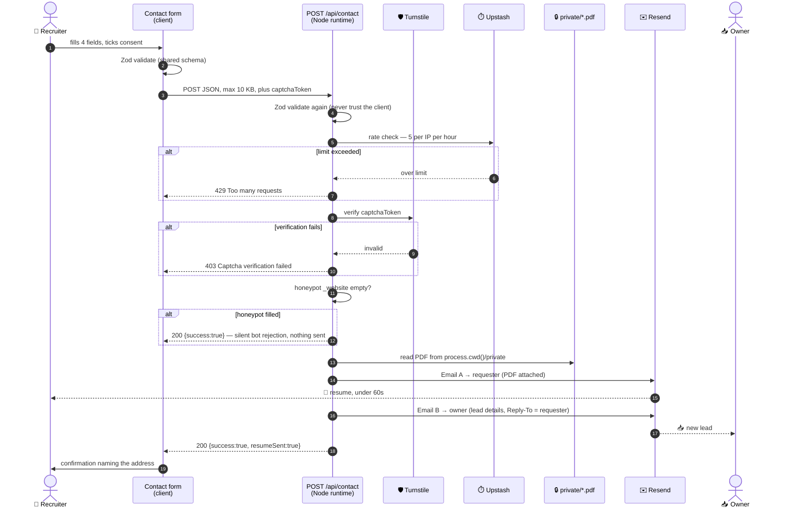

**Implementation notes**

- `export const runtime = 'nodejs'` is mandatory. The Edge runtime cannot read from the filesystem, and the resume deliberately does not live in `public/`.
- ⏱️ **Set `export const maxDuration`** on the route. It awaits two Resend calls, one carrying a PDF attachment, after a Turnstile round-trip and a Redis read. The platform default is tight enough that a slow provider turns a captured lead into a 504. Budget generously and log the elapsed time.
- Both sends are awaited. A failure on either is logged; the requester still gets a usable error with the `mailto:` fallback.

**📤 Email A — to the requester**
Subject: `Romualdo Dasig — Software Engineer Resume`
Body: brief thank-you, LinkedIn and GitHub links, portfolio URL. **Never echo the submitted message back** (a reflected-content vector, and it reads oddly).
Attachment: `romualdo-dasig-resume.pdf`.

**📥 Email B — to the owner**
Subject: `New portfolio inquiry from {name} ({company})`
Body: all form fields, timestamp in **Asia/Manila**, referrer, and whether the resume was requested.
`Reply-To`: the submitter's address, so the owner replies directly.

### FR-7a — Gating rules

The PDF is delivered by email only. Everything below follows from that:

- 🚫 **No "Resume" item in the navigation.** The current site has one linking straight to the file. It does not carry over. The Hero CTA is the only entry point.
- 🚫 **No direct link in the footer, the About section, or the Open Graph metadata.**
- ⚠️ **The file must actually be deleted from the current host at cutover.** `https://www.dasigr.com/romualdo-dasig-resume.pdf` is live today and may be indexed. A 301 is necessary but *not sufficient* — if the file survives at its old location on the origin or in a CDN cache, **the gate is decorative.** Confirm with a direct request against production after deploy.
- 🕐 **Expect an indexed copy to persist.** Search engines may serve a cached copy until they recrawl. Nothing to do beyond the redirect and a Search Console removal request; note it and move on.
- 🔓 **The gate is for lead capture, not secrecy.** Anyone who receives the PDF can forward it, and recruiters routinely will — that is fine and expected. The goal is *knowing who asked*, not controlling redistribution. **Do not add DRM, watermarking, or expiring links**; they add friction and break the forwarding a recruiter needs to do to advocate for you.

**The friction this buys, and how to keep it low.** Some recruiters will leave rather than fill a form. That cost is accepted in exchange for G-5, but it must be minimised: four fields only, resume box pre-checked, captcha invisible, delivery under 60 seconds, visible `mailto:` fallback. **A form that errors silently loses the lead entirely — worse than no gate at all.**

### FR-8 — Direct contact channels

- ✉️ Email rendered **obfuscated** (assembled in JS or as an SVG) to resist scrapers.
- 🔗 LinkedIn and GitHub links.
- 🚫 **Remove the phone number, Skype handle, and home street address from public display.** Publishing a residential address is an unnecessary personal-safety and privacy exposure; city-level location ("Cebu, Philippines") gives recruiters the geographic signal they actually need. Phone contact can be shared privately once a conversation starts.
- ⚠️ Note that `a5project.com` still publishes the street address and two mobile numbers. Removing it from the new site does not remove it from the web — worth a pass over that site too.

### FR-9 — Testimonials

Full content rules in [§6.8](#68-testimonials-currently-zero-publishable-). Requirements:

- Static grid of 2–4 quotes, **no carousel**.
- Each card: verbatim quote, author name, role and company where known.
- No star ratings, no stock avatars, no oversized quotation-mark graphics.
- Placed between Projects and Contact.
- **Consent is a hard gate.** Entries with `consentObtained: null` are filtered by `publishableTestimonials` and cannot reach the page.
- **The section — and its nav item — do not render when nothing is publishable.**

### FR-10 — Case studies

One page per featured project at `/projects/{slug}`, statically generated. Content in `src/content/case-studies.ts`, keyed by project slug.

**Structure:** summary · problem · constraints · approach · **key decisions with trade-offs** · outcome · role, team, duration · full stack · screenshots. The decisions block is what distinguishes this from a feature list: a named choice, why it was made, and what it cost.

**Requirements**

- ✅ Project cards link to a case study **only** when one is publishable.
- ✅ `generateStaticParams()` is driven by `caseStudySlugs`, so unwritten studies produce **no route** — no 404s, no half-pages.
- ✅ Each page exports `generateMetadata()` with its own title, description, and OG image.
- ✅ Each page has a visible "← Back to portfolio" link to `/#projects`.
- ✅ `src/app/sitemap.ts` includes every published case study URL.
- ✅ Same accessibility and performance budgets as `/`. These are Server Components; they should ship **zero** client JS.
- ✅ Screenshots via `next/image`, in `/public/images/case-studies/`.
- ℹ️ **Expected launch state: zero published.** Cards ship link-less; the sitemap contains only `/` and `/privacy`. Not a defect.

---

## 8. API contract

### `POST /api/contact`

**Request**

```json
{
  "name": "Jane Recruiter",
  "email": "jane@example.com",
  "company": "Acme Corp",
  "message": "We have a senior React role that fits your background.",
  "requestResume": true,
  "consent": true,
  "captchaToken": "0.abc123...",
  "_website": ""
}
```

**Responses**

| Status | Body | Meaning |
|--------|------|---------|
| `200` | `{ "success": true, "resumeSent": true }` | Accepted and processed |
| `200` | `{ "success": true, "resumeSent": true }` | 🕵️ **Honeypot tripped** — identical body, nothing sent. The response must not differ, or the bot learns it was caught |
| `200` | `{ "success": true, "resumeSent": false }` | Valid submission with the resume box unticked |
| `400` | `{ "success": false, "errors": { "email": "Invalid email address" } }` | Validation failure |
| `403` | `{ "success": false, "error": "Captcha verification failed" }` | Bot suspected |
| `429` | `{ "success": false, "error": "Too many requests" }` | Rate limit hit |
| `500` | `{ "success": false, "error": "Unable to send. Please email directly." }` | Email provider failure |

**Server-side rules**

| Rule | Detail |
|------|--------|
| 🔁 **Rate limit** | 5 requests per IP per hour, counted in **Upstash Redis**. An in-memory counter will not work — each invocation may run in a fresh instance. Read the client IP from `x-forwarded-for` |
| 📦 **Payload cap** | 10 KB |
| 🧼 **Sanitize** | All fields before interpolating into email HTML — prevents header injection and HTML injection |
| 🔇 **Never echo** | Do not return the submitted message to the submitter in Email A |
| 🔑 **Secrets** | API keys from environment variables only. Never committed, never exposed to the client bundle |
| ✅ **Validate twice** | The same Zod schema runs in the Client Component *and* in the handler. Client validation is UX; server validation is the control |

---

## 9. Non-functional requirements

### 9.1 ⚡ Performance

| Metric | Budget |
|--------|--------|
| Lighthouse Performance (mobile) | ≥ 90 |
| Lighthouse Accessibility | ≥ 95 |
| Lighthouse Best Practices | ≥ 95 |
| Lighthouse SEO | ≥ 95 |
| Largest Contentful Paint (simulated 4G) | < 2.5 s |
| Cumulative Layout Shift | < 0.1 |
| **First Load JS for `/`** | **< 120 KB gzipped** |

- The figure reported by `next build` is the number to watch. Any regression traces to a new `'use client'` boundary.
- All images through `next/image` — WebP/AVIF, `srcset`, lazy loading, dimension reservation. Hero portrait gets `priority`; project thumbnails do not.
- Fonts via `next/font` — self-hosted and preloaded, no third-party request.

### 9.2 ♿ Accessibility — WCAG 2.1 AA

- Semantic landmarks: `<header>`, `<nav>`, `<main>`, `<section>`, `<footer>`.
- Full keyboard navigability with a visible focus ring; **"Skip to content" first in tab order**.
- Text contrast ≥ 4.5:1. *(Check the mockup's `--dim: #6C8394` on `--bg: #0F1922` — small text at that pairing is borderline and should be measured, not assumed.)*
- Every form input has an associated `<label>`; errors linked via `aria-describedby` and announced via `aria-live`.
- Animations disabled under `prefers-reduced-motion: reduce`.
- Every image has meaningful alt text. The career-bus graphic needs a full text alternative, not a label.

### 9.3 🔍 SEO

Server rendering is no longer something to engineer — the App Router statically renders `/` at build and serves crawlers full HTML by default. The remaining work is metadata.

- `metadata` export in `src/app/layout.tsx`: title, description, `metadataBase`, canonical `https://www.dasigr.com/`.
- Open Graph + Twitter Card via the same export, 1200×630 preview. `src/app/opengraph-image.tsx` generates it at build.
- **JSON-LD `Person` schema** — `name`, `jobTitle`, `url`, `sameAs` (LinkedIn, GitHub), `address` at **locality level only** — rendered from a Server Component so it lands in the initial HTML.
- `src/app/sitemap.ts` and `src/app/robots.ts` rather than static files. Sitemap = `/` + `/privacy` + every published case study.
- Each case study exports its own `generateMetadata()` — this is where the per-page metadata the single-page design gave up is regained.

**301 redirects** in `redirects()` in `next.config.ts`:

| Old path | Server redirects to | Browser then resolves |
|----------|--------------------|----------------------|
| `/index.html` | `/` | — |
| `/about.html` | `/` | `#about` |
| `/projects.html` | `/` | `#projects` |
| `/contact.html` | `/` | `#contact` |
| `/romualdo-dasig-resume.pdf` | `/` | `#contact` |

> ⚠️ **A hash fragment is never sent to the server.** Declaring `/about.html → /#about` is fine as configuration shorthand, but the server only ever sees and returns `/`; the browser preserves and applies the fragment. **Verify the scroll actually lands after hydration** — this is the part that silently breaks.
>
> The **PDF redirect matters most**: that URL is live today and may be indexed or bookmarked. Removing the file without a redirect turns saved links into 404s and strands anyone who kept one.

### 9.4 🔒 Security

- HTTPS enforced; HSTS enabled.
- Content Security Policy restricting script sources.
- Headers: `X-Content-Type-Options: nosniff`, `Referrer-Policy: strict-origin-when-cross-origin`, `X-Frame-Options: DENY`.
- No secrets in the client bundle — only `NEXT_PUBLIC_`-prefixed variables reach the browser, which is exactly why the Resend key and the Turnstile **secret** must never carry that prefix.
- Dependencies audited before each release; monthly Next.js security line tracked (§4.3).
- **Repository private while the resume PDF is committed to it** (§11.1).

### 9.5 🛡️ Privacy

The site collects personal data from Philippine and international visitors, so the **Data Privacy Act of 2012 (RA 10173)** applies, and **GDPR** may apply to EU-based recruiters.

- Explicit consent checkbox, **unchecked by default**, stating what the data is used for.
- A short privacy notice at `/privacy`, linked from the form: what is collected, why, how long it is retained, and how to request deletion.
- **Retention:** lead emails kept as long as the inquiry is live. No database in v1, so the owner's mailbox is the only store — say exactly that in the notice rather than inventing a policy the setup cannot enforce.
- Cookieless analytics, so no consent banner is required.
- Testimonial consent is the same legal basis, tracked separately (§6.8).

### 9.6 🌐 Browser and device support

- Latest two versions of Chrome, Firefox, Safari, Edge.
- iOS Safari 15+, Chrome Android.
- Breakpoints verified at **320px · 768px · 1024px · 1440px**.

### 9.7 ✉️ Email domain setup — *do this early, it blocks Phase 5*

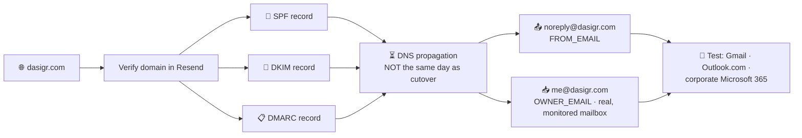

- ❌ **A Gmail address cannot be the `From`.** Sending as `@gmail.com` through Resend fails Gmail's DMARC policy and the mail lands in spam or is rejected outright. `me@dasigr.com` is not merely tidier — **it is what makes the gated delivery in FR-7 work at all.**
- 📬 **Two mailboxes, one domain.** `OWNER_EMAIL=me@dasigr.com` receives Email B. `FROM_EMAIL` is a distinct no-reply sender (`noreply@dasigr.com`) so bounces and replies stay separated. Email A's `Reply-To` still points at `me@dasigr.com`.
- 👀 **`me@dasigr.com` must be a real, monitored mailbox**, forwarding to wherever the owner actually reads mail. A published address nobody watches is worse than a Gmail address that works.
- 🧪 **Test to Gmail, Outlook, and a corporate Microsoft 365 tenant** before launch. Recruiters are disproportionately on the last of these, and *a PDF attachment from a newly-verified domain* is exactly the profile that gets quarantined.

---

## 10. Analytics

Cookieless, no personally identifying data:

| Event | Why |
|-------|-----|
| Page views / unique visitors | Baseline |
| Section scroll depth | Does the recruiter reach Projects at all? |
| **Resume request submissions** | ⭐ The conversion event — this is the number the whole rebuild exists to move |
| Outbound clicks per project link | Which work actually gets clicked; informs the next featured set |
| Referrer sources | LinkedIn vs search vs direct |

**Decision:** Vercel Analytics for v1 — one fewer vendor, cookieless, zero config on the hosting platform already chosen. Switch to Plausible if the owner wants data portable off Vercel or a public dashboard.

---

## 11. Project structure

```
dasigr-app/
├── src/                            # ⚠️ All application code lives under src/
│   ├── app/
│   │   ├── layout.tsx              # Root layout, metadata export, next/font
│   │   ├── page.tsx                # The single page — composes all SEVEN sections
│   │   ├── globals.css             # @import "tailwindcss" + @theme (Tailwind v4)
│   │   ├── sitemap.ts
│   │   ├── robots.ts
│   │   ├── opengraph-image.tsx
│   │   ├── privacy/
│   │   │   └── page.tsx            # Privacy notice (§9.5)
│   │   ├── projects/
│   │   │   └── [slug]/
│   │   │       └── page.tsx        # Case study — generateStaticParams + generateMetadata
│   │   └── api/
│   │       └── contact/
│   │           └── route.ts        # runtime = 'nodejs', maxDuration set
│   ├── components/
│   │   ├── layout/                 # Header ('use client'), Nav, Footer
│   │   ├── sections/               # Hero, About, Skills, Experience,
│   │   │                           #   Projects, Testimonials, Contact
│   │   └── ui/                     # Button, Card, Tag, Input, Spinner
│   ├── content/
│   │   ├── profile.ts
│   │   ├── skills.ts
│   │   ├── experience.ts
│   │   ├── projects.ts             # + excludedFromPortfolio + derived counts
│   │   ├── testimonials.ts         # + publishableTestimonials + hasTestimonials
│   │   └── case-studies.ts         # + isPublishable + caseStudySlugs
│   ├── lib/
│   │   ├── schema.ts               # Zod — imported by form AND route handler
│   │   ├── schema.test.ts          # Colocated Vitest unit test
│   │   ├── email.ts                # Email A / Email B templates
│   │   ├── rate-limit.ts           # Upstash
│   │   └── analytics.ts
│   └── types/                      # Shared interfaces (§6.2) where not colocated
├── private/                        # 🔒 Repo root, NOT under src/ — see §11.1
│   └── romualdo-dasig-resume.pdf   #    Outside public/ — never served directly
├── public/                         # Repo root — served verbatim at /
│   ├── favicon.svg
│   └── images/
│       ├── portrait.webp
│       ├── projects/               # 800×600 WebP
│       └── case-studies/
├── context/                        # This spec + coding standards + workflow
├── .env.example
├── next.config.ts                  # redirects(), images, security headers,
│                                   #   outputFileTracingIncludes
├── vitest.config.mts               # environment: node, include src/{actions,lib}
└── tsconfig.json                   # paths: { "@/*": ["./src/*"] }
```

**Why `src/` and what it changes.** The repo was scaffolded with the `src/` layout, and `tsconfig.json` maps `@/*` → `./src/*`. Import content and utilities by alias — `import { projects } from "@/content/projects"` — not by relative path. Two directories deliberately stay at the repo root:

- **`public/`** — Next.js only serves static assets from the project root, not from `src/public/`.
- **`private/`** — read with `path.join(process.cwd(), "private", …)`, and `process.cwd()` is the project root at runtime. Putting it under `src/` would break that path in production while still working in some local setups.

Server Actions, if any are added later, go in `src/actions/` per [coding-standards.md](./coding-standards.md#file-organization). The Vitest scope (`src/{actions,lib}/**/*.test.ts`) is written against these paths — moving `lib/` out of `src/` silently empties the test suite rather than failing it.

### 11.1 ⚠️ Storing the resume in the repo

At the owner's revision frequency — a few times a year — a commit and redeploy per revision is cheaper than wiring up object storage, and it keeps the PDF versioned alongside the code that serves it. **Three things follow.**

**🔐 The repository must be private.** This is the part that is easy to miss, and it silently defeats FR-7a. A public GitHub repo serves every file over `raw.githubusercontent.com`, so a committed PDF is **a public download with a stable URL** — no form, no lead capture, and indexable. Everything FR-7a specifies about deleting the file from the old host is undone by committing it to a public repo.

If the repo is currently public, or was *ever* public while the PDF was committed: **git history retains the file after deletion.** Removing it from `HEAD` is not enough — the blob stays reachable by commit SHA. If that has happened, treat the PDF as disclosed and either accept it or rewrite history.

**💸 This costs the portfolio-as-code-sample benefit.** A public repo for a portfolio site is itself a work sample; a hiring manager who likes the site may want to read the source. Two ways to keep both:

1. Public repo for the code, PDF moved to Vercel Blob or S3 and fetched by the Route Handler at request time. *(Revisit as v1.1.)*
2. Two repos: public code, private asset pulled in at build. *More moving parts than this project warrants.*

**Recommendation for v1: private repo. Revisit if a specific employer asks for source.**

**🚚 Deployment mechanics — the failure that does not reproduce locally.** `private/` sits outside `public/`, so Next.js will not *serve* it — but Vercel's file tracing may also not *include* it in the deployment bundle, in which case the Route Handler throws `ENOENT` at runtime and **every resume request fails**. Set `outputFileTracingIncludes` in `next.config.ts` for the contact route, and read with `path.join(process.cwd(), 'private', 'romualdo-dasig-resume.pdf')`. **Verify by requesting an actual resume delivery against production**, not just locally — this does not reproduce in `next dev`.

### 11.2 Environment variables

```bash
# Server-side only — never prefixed with NEXT_PUBLIC_
RESEND_API_KEY=
OWNER_EMAIL=me@dasigr.com
FROM_EMAIL=noreply@dasigr.com
TURNSTILE_SECRET_KEY=
UPSTASH_REDIS_REST_URL=
UPSTASH_REDIS_REST_TOKEN=

# Reaches the browser — safe by design
NEXT_PUBLIC_TURNSTILE_SITE_KEY=
NEXT_PUBLIC_SITE_URL=https://www.dasigr.com
```

---

## 12. Milestones

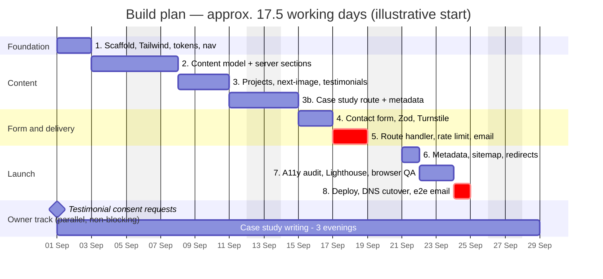

| Phase | Scope | Est. | Prerequisite |
|-------|-------|------|--------------|
| 1 | `create-next-app`, Tailwind, design tokens, root layout, responsive nav | 2 d | — |
| 2 | Content model + Hero, About, Skills, Experience as Server Components | 3 d | Owner confirms §6.4 dates and bullets |
| 3 | Projects section, `next/image`, thumbnail re-capture, Testimonials | 2.5 d | 🖼️ Fresh thumbnails · stack lists |
| 3b | Case study route, template, metadata, sitemap entries | 2 d | Route ships empty — no content dependency |
| 4 | Contact form Client Component, Zod validation, Turnstile | 2 d | Turnstile keys |
| 5 | Route Handler, rate limiting, email templates, PDF attachment flow | 2 d | ⛔ **§9.7 DNS must be done and propagated** |
| 6 | Metadata API, sitemap/robots, JSON-LD, redirects, analytics | 1 d | — |
| 7 | Accessibility audit, bundle/Lighthouse tuning, cross-browser QA | 2 d | — |
| 8 | Deploy to Vercel, DNS cutover, end-to-end email verification | 1 d | Old PDF deleted from origin |

**Total ≈ 17.5 working days of build.**

> ✍️ **Writing the case studies is separate and sits with the owner.** Budget an evening each and **do not let it block launch** — the route ships empty and fills as studies are written. The same applies to testimonial consent: the section hides itself until replies come back.

---

## 13. Acceptance criteria

Launch is blocked until all of the following pass.

**Structure and content**

- [ ] Every section reachable by scroll, nav click, and direct URL — no full page reloads.
- [ ] All **15** employment entries present with dates (12 software + 3 collapsed under "Earlier career").
- [ ] Timeline renders as one continuous reverse-chronological sequence from Nov 2008 with **no visible gap** and no appearance of a date error.
- [ ] Site and PDF agree on employer names, role titles, project counts (**8 / 3**), and the years-of-experience claim (**17+**).
- [ ] Portrait alt text is the owner's name, not `John Doe`.

**Projects and case studies**

- [ ] **Every** project URL returns 200, verified within a week of launch.
- [ ] No project renders a dead link — removed or rendered link-less instead.
- [ ] Projects without a publishable case study render with **no link** and generate **no route**.
- [ ] Every published case study route returns 200 with its own title, description, and OG image. *(Vacuously true at launch — zero published.)*
- [ ] Each published case study states an **outcome**, not only a description of the work.

**Testimonials**

- [ ] Every rendered testimonial has a non-null `consentObtained` **and** a verbatim quote.
- [ ] The section **and its nav item** are absent when nothing is publishable.

**Form and delivery**

- [ ] Form rejects invalid input client-side **and** server-side.
- [ ] A valid submission with the resume box ticked delivers the PDF within 60 seconds.
- [ ] The owner receives a notification email with all lead details and a **working `Reply-To`**.
- [ ] Honeypot and captcha both block automated submissions in testing, and the honeypot response is byte-identical to a success.
- [ ] Rate limiting survives across **separate** serverless invocations — verified by repeated submissions, not one warm instance.
- [ ] Delivery verified **against production**, confirming the PDF was traced into the deployment bundle.

**The gate actually holds**

- [ ] The PDF is not reachable at any guessable public URL — directly request `/private/romualdo-dasig-resume.pdf` **and** the old `/romualdo-dasig-resume.pdf` against production.
- [ ] The file is **deleted from the current host**, not merely redirected.
- [ ] Repository confirmed **private**, and git history checked for a previously-committed copy.
- [ ] No `Resume` nav item, footer link, or OG link to the PDF anywhere in the page source.

**Performance, accessibility, compatibility**

- [ ] `next build` reports First Load JS under the §9.1 budget for `/`.
- [ ] `curl` of the deployed page returns full section content in the HTML body with JS disabled.
- [ ] Lighthouse mobile scores meet the §9.1 thresholds.
- [ ] Keyboard-only navigation reaches and operates every interactive element.
- [ ] Screen reader announces form errors.
- [ ] Layout verified at 320px, 768px, 1024px, 1440px.
- [ ] Old `.html` URLs 301-redirect and the anchor resolves after hydration.

**Privacy**

- [ ] Phone number, Skype handle, and street address absent from the public page source.
- [ ] Privacy notice live at `/privacy` and linked from the form.
- [ ] Consent checkbox unchecked by default and required to submit.

---

## 14. Decision log and open questions

### 14.1 Resolved

| # | Question | Decision (2026-08-25 unless noted) |
|---|----------|-----------------------------------|
| 1 | React or Angular? | **Next.js 16, App Router** |
| 2 | Employment dates | Supplied via `Resume-202607.pdf`, seeded into §6.3 |
| 3 | Gate the PDF behind the form? | **Yes.** No direct link anywhere (FR-7a) |
| 4 | Case studies? | **In scope.** `/projects/{slug}`, three to start (FR-10) |
| 5 | Testimonials section? | **Yes**, gated on consent (FR-9) |
| 6 | Email provider | **Resend.** Domain verification blocks Phase 5 (§9.7) |
| 7 | Resume versioning | **PDF in repo** at `private/`. Requires a private repository (§11.1) |
| 8 | Include education? | **Yes** — one plain line, low on the page (FR-4b) |
| 9 | Which freelance entries are current? | **Only Jun 2026 – Present.** The first stint ended Jul 2011 |
| 10 | Which projects get featured? | **CebuFest · PV System Tek · Accu-Glass Products** |
| 11 | Keep the four site-only projects? | **No.** All dropped, recorded in `excludedFromPortfolio` |
| 12 | How to handle the two employment gaps? | Both were freelance periods, now entries. Timeline continuous |
| 13 | Which address to publish? | **`me@dasigr.com`** (§9.7) |
| 14 | Spam provider | **Cloudflare Turnstile** *(2026-08-26 — `.env` already assumed it)* |
| 15 | Analytics | **Vercel Analytics** for v1 *(2026-08-26)* |
| 16 | Version pinning | Track current stable **16.x**; "Active LTS" is the major, not a minor *(2026-08-26, §4.3)* |

### 14.2 Open

| # | Question | Owner? | Blocks |
|---|----------|--------|--------|
| **Q-A** | Exact start/end months for the two derived freelance periods | Owner | Phase 2 |
| **Q-B** | Real bullets for those two periods — current text is drafted, not supplied | Owner | Phase 2 |
| **Q-C** | Per-project: sole developer or led a team? Every `role` carries a `TODO: confirm` | Owner | Phase 3 |
| **Q-D** | Per-project stack gaps: DB, hosting, styling, TypeScript, Agoda API vs deep links | Owner | Phase 3 |
| **Q-E** | Testimonial consent × 4, and the Viacom attribution question | Owner | Testimonials section renders or stays hidden |
| **Q-F** | Case study `outcome` figures — traffic, orders, conversion, load time | Owner | Case study routes generate or stay empty |
| **Q-G** | Fresh 800×600 thumbnails for the three featured projects | Owner | Phase 3 |
| **Q-H** | Is `a5project.com` staying up? It publishes the street address and two mobile numbers FR-8 removes | Owner | Privacy posture |

---

## 15. Future enhancements (post-v1)

| | Enhancement | Note |
|---|-------------|------|
| 📚 | Case studies for the remaining five lead projects | Content-only; no code change |
| 🗄️ | **Lead storage in a database with a private dashboard** | This is what the [Prisma draft](#66-prisma-schema-rough-draft-not-v1-) is for. Build the `Lead` half only |
| ☁️ | PDF in Vercel Blob / S3, repo made public | Recovers the portfolio-as-code-sample benefit (§11.1) |
| ✍️ | Blog or technical writing section | Would reopen the single-page decision |
| 📄 | Resume in multiple formats (PDF + plain text for ATS parsers) | Cheap, real benefit for automated screening |
| 🌗 | Light theme | Non-goal in v1 |
| 🏷️ | Filter projects by technology tag | Only worth it above ~12 projects |

---

## Appendix A — Reference links

**Framework and hosting**

- [Next.js App Router docs](https://nextjs.org/docs/app) · [Route Handlers](https://nextjs.org/docs/app/building-your-application/routing/route-handlers) · [Metadata API](https://nextjs.org/docs/app/api-reference/functions/generate-metadata) · [`generateStaticParams`](https://nextjs.org/docs/app/api-reference/functions/generate-static-params)
- [Next.js support policy](https://nextjs.org/support-policy) · [Next.js blog / security releases](https://nextjs.org/blog)
- [`next/image`](https://nextjs.org/docs/app/api-reference/components/image) · [`next/font`](https://nextjs.org/docs/app/api-reference/components/font) · [`redirects()`](https://nextjs.org/docs/app/api-reference/config/next-config-js/redirects)
- [Vercel docs](https://vercel.com/docs) · [Vercel Analytics](https://vercel.com/docs/analytics)

**Form, email, protection**

- [Zod](https://zod.dev) · [React Hook Form](https://react-hook-form.com)
- [Resend docs](https://resend.com/docs) · [Resend domain verification](https://resend.com/docs/dashboard/domains/introduction)
- [Cloudflare Turnstile](https://developers.cloudflare.com/turnstile/) · [Upstash Redis](https://upstash.com/docs/redis)

**Data layer (v1.1 only)**

- [Prisma schema reference](https://www.prisma.io/docs/orm/prisma-schema) · [Prisma with Next.js](https://www.prisma.io/docs/guides/nextjs)

**Standards and compliance**

- [WCAG 2.1 AA quick reference](https://www.w3.org/WAI/WCAG21/quickref/?levels=aaa)
- [Data Privacy Act of 2012 (RA 10173)](https://privacy.gov.ph/data-privacy-act/) · [National Privacy Commission](https://privacy.gov.ph/)
- [GDPR text](https://gdpr-info.eu/)
- [Schema.org `Person`](https://schema.org/Person)

**Project artifacts**

| File | Role |
|------|------|
| `portfolio-spa-spec.md` (v2.3) | Superseded by this document |
| `dasigr-portfolio-mockup.html` | Static visual mockup — "test bench" direction, non-functional |
| `src/content/projects.ts` | 8 lead + 3 maintenance + `excludedFromPortfolio` |
| `src/content/testimonials.ts` | 4 entries, all consent-blocked |
| `src/content/case-studies.ts` | 3 scaffolds, all unpublishable |
| `RomualdoDasigResume.pdf` | Source of truth for employment; **needs the §6.10 revisions** |

---

<sub>Document v3.1 · consolidated from spec v2.3 · 2026-08-26 · Romualdo Dasig — dasigr.com</sub>
